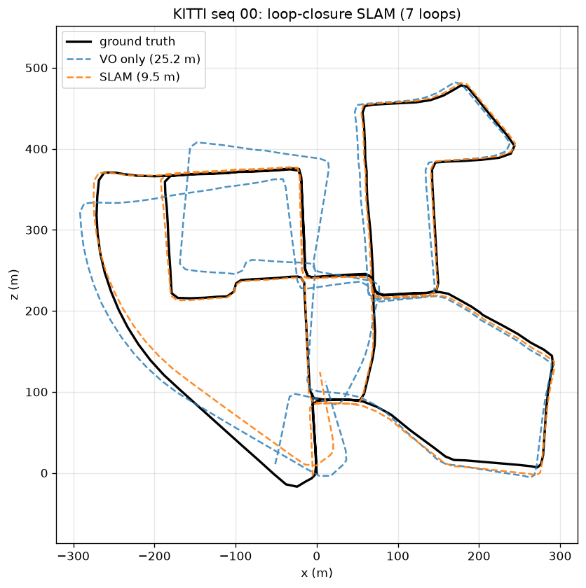
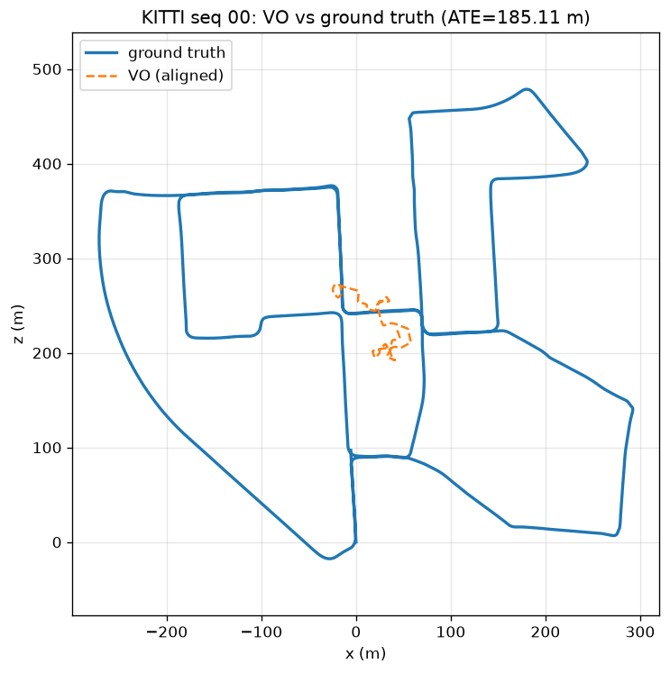
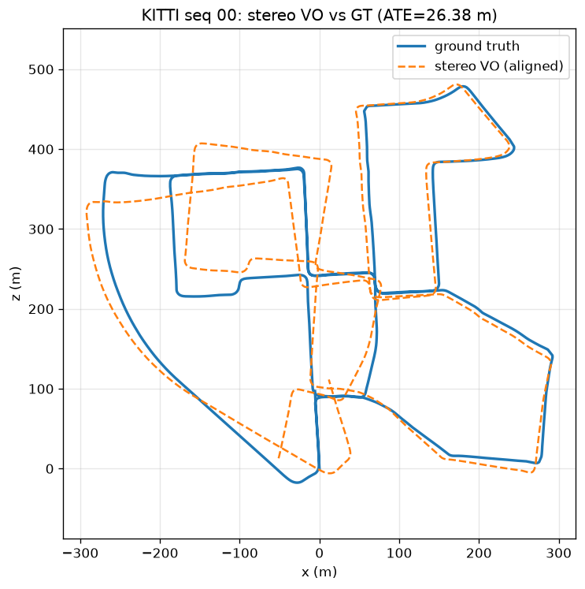

# CarlaPerception — Visual Perception & SLAM for Self-Driving

A from-scratch self-driving **visual-perception and geometry** stack: 2D perception
(detection, tracking, segmentation) plus a full geometric pipeline — **monocular →
stereo visual odometry → loop-closure SLAM** — evaluated on the KITTI odometry
benchmark. Built in Python with a clean, tested, config-driven codebase.

> **Headline:** stereo SLAM on KITTI seq 00 — loop closure + pose-graph
> optimization cut trajectory drift **62% (ATE 25 m → 9.5 m)** over a 3.7 km loop.



*VO drifts (blue); loop-closure SLAM (orange) tracks ground truth (black).*

---

## Results

| Capability | Result (KITTI seq 00) | Implementation |
|---|---|---|
| Monocular VO | RPE ≈ 0.26 m; **scale collapses** over the full loop | ORB + essential matrix |
| **Stereo VO** | **metric scale; ATE ≈ 26 m (~0.7%)** | stereo depth + PnP |
| **Loop-closure SLAM** | **ATE 25 m → 9.5 m (−62%)**, 7 loop closures | pose-graph optimization |
| Object detection | vehicles + pedestrians, real-time | YOLO wrapper |
| Semantic segmentation | per-pixel class map | DeepLabV3 wrapper |
| Multi-object tracking | persistent IDs across frames | IoU tracker (unit-tested) |

**Why the progression matters:** monocular VO can't recover real-world scale, so
its trajectory collapses. Stereo fixes scale via the known camera baseline. Loop
closure then removes the remaining drift by recognizing revisited places and
globally optimizing the trajectory — the core of modern SLAM.

| Monocular VO (scale collapse) | Stereo VO (metric) |
|---|---|
|  |  |

---

## Architecture

```
            ┌──────────── PERCEPTION (Python) ────────────┐
 frames ──► │ detection (YOLO) · tracking (IoU) ·         │
            │ segmentation (DeepLabV3) · PerceptionPipeline│
            └─────────────────────────────────────────────┘
            ┌──────────── GEOMETRY / SLAM ────────────────┐
 stereo ──► │ monocular VO ─► stereo VO (metric, PnP)      │
            │        └─► loop-closure pose-graph SLAM       │
            └─────────────────────────────────────────────┘
            ┌──────────── EVALUATION ─────────────────────┐
            │ ATE / RPE · Umeyama alignment · KITTI loader │
            │ trajectory plots vs ground truth            │
            └─────────────────────────────────────────────┘
```

| Path | What it does |
|---|---|
| `perception_py/carla_perception/detection` | object detection wrapper |
| `…/segmentation`, `…/tracking` | semantic segmentation, multi-object tracking |
| `…/pipeline.py` | combined per-frame perception |
| `…/vo/monocular_vo.py`, `…/vo/stereo_vo.py` | visual odometry (mono + stereo/metric) |
| `…/slam/pose_graph.py`, `…/slam/stereo_slam.py` | SE2 pose-graph optimizer + loop closure |
| `…/datasets/kitti.py`, `…/trajectory.py`, `…/metrics.py` | KITTI loader, alignment, ATE/RPE/IoU |
| `scripts/` | runnable demos + KITTI evaluation scripts |

---

## Quickstart

```bash
python -m venv .venv && source .venv/bin/activate
pip install -e ".[dev,ml]"          # base + dev + deep-learning extras
python -m pytest                    # 21 tests

# Perception demos (download a sample image automatically)
python scripts/demo_perception.py   # detection + segmentation in one pass
python scripts/demo_tracking.py     # tracking over a frame sequence

# Geometry on KITTI (see docs/SETUP_KITTI.md to get the data)
python scripts/run_stereo_vo_kitti.py --root <kitti> --sequence 00
python scripts/run_slam_kitti.py     --root <kitti> --sequence 00 --stride 20 \
    --loop-weight 4 --f-scale 1.5 --min-inliers 40
```

> Tip: the SLAM script caches the slow VO/feature pass, so re-running to tune
> loop-closure parameters takes seconds.

---

## Engineering

- **Tested:** 21 unit tests, including synthetic-geometry tests that verify VO
  pose recovery, stereo metric scale, trajectory alignment, and loop closure —
  all without needing image data, so they run in CI.
- **Tooling:** Hydra configs, DVC, ruff + mypy, pre-commit, GitHub Actions CI.
- **Performance:** pose-graph optimization uses a robust loss + a **sparse
  Jacobian**, turning the solve from minutes to seconds.

### Notable problems solved
- **SE2 coordinate-frame handedness** — KITTI's downward Y axis flips planar yaw;
  getting this wrong made loop closure diverge.
- **Odometry/graph consistency** — deriving edges from projected node poses so
  only loop closures drive the correction.
- **Optimizer scalability** — sparse-Jacobian finite differences for fast solves.

---

## Roadmap

Done: perception stack · monocular/stereo VO · KITTI evaluation · loop-closure SLAM.
Next: interactive web demo · dense 3D / Gaussian-Splatting reconstruction · CARLA
multi-sensor capture · ONNX/TensorRT edge optimization · C++ geometry core (g2o/GTSAM).
See `STATUS.md` for the full breakdown.

## License

MIT
