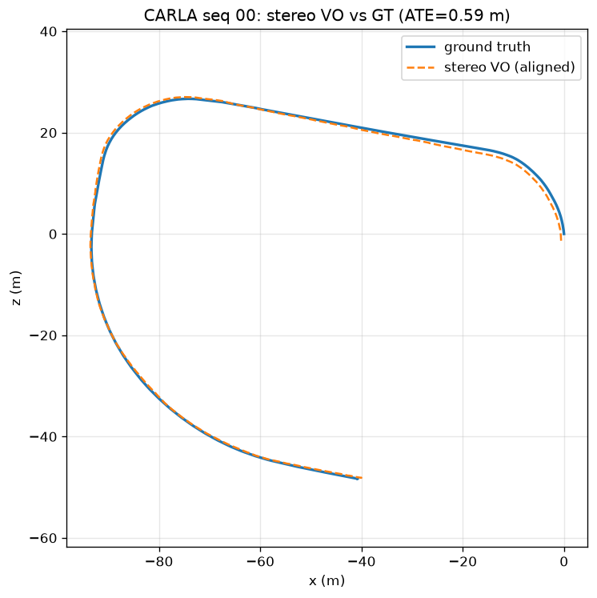
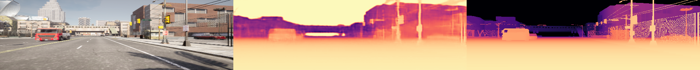
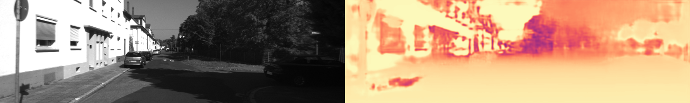

# CarlaPerception - Visual Perception & SLAM for Self-Driving

A from-scratch self-driving **visual-perception and geometry** stack: 2D perception
(detection, tracking, segmentation) plus a full geometric pipeline - **monocular ->
stereo visual odometry -> loop-closure SLAM** - plus a **learned monocular-depth**
network (deep learning) and self-generated CARLA data, evaluated on the KITTI
odometry benchmark. Built in Python with a clean, tested, config-driven codebase.

> **Headline:** stereo SLAM on KITTI seq 00 - loop closure + pose-graph
> optimization cut trajectory drift **62% (ATE 25 m -> 9.5 m)** over a 3.7 km loop.


*VO drifts (blue); loop-closure SLAM (orange) tracks ground truth (black).*

---

## Results

| Capability | Result (KITTI seq 00) | Implementation |
|---|---|---|
| Monocular VO | RPE ≈ 0.26 m; **scale collapses** over the full loop | ORB + essential matrix |
| **Stereo VO** | **metric scale; ATE ≈ 26 m (~0.7%)** | stereo depth + PnP |
| **Loop-closure SLAM** | **ATE 25 m -> 9.5 m (-62%)**, 7 loop closures | pose-graph optimization |
| Loop-closure SLAM (seq 05) | **ATE 8.6 m -> 5.8 m (-33%)**, same params | generalizes, no per-seq tuning |
| Object detection | vehicles + pedestrians, real-time | YOLO wrapper |
| Semantic segmentation | per-pixel class map | DeepLabV3 wrapper |
| **Dense 3D reconstruction** | colored point-cloud map (~440K points) | SGBM stereo + pose fusion |
| Multi-object tracking | persistent IDs across frames | IoU tracker (unit-tested) |
| **Neural 3D (Gaussian Splatting)** | photorealistic novel-view flythrough, **COLMAP-free** | splatfacto on *our* stereo-VO poses |
| **CARLA self-recorded drive** | stereo VO **ATE ≈ 0.59 m** vs *perfect* ground truth | synchronized capture -> same pipeline |
| **Learned monocular depth (DL)** | **AbsRel 0.21, delta1 0.74** on held-out CARLA | ResNet-U-Net trained from scratch on CARLA GT depth |

**Why the progression matters:** monocular VO can't recover real-world scale, so
its trajectory collapses. Stereo fixes scale via the known camera baseline. Loop
closure then removes the remaining drift by recognizing revisited places and
globally optimizing the trajectory - the core of modern SLAM.

| Monocular VO (scale collapse) | Stereo VO (metric) |
|---|---|
|  |  |

---

## Neural 3D - Gaussian Splatting (COLMAP-free)

The geometry pipeline doesn't just *estimate* a trajectory - it can *reconstruct
the scene*. I feed the camera poses from **my own stereo visual odometry** straight
into a Gaussian-Splatting trainer (nerfstudio `splatfacto`), skipping the COLMAP
structure-from-motion step that this workflow normally depends on. The result is a
photorealistic, free-viewpoint 3D model of the KITTI street (~641K Gaussians).


*Novel-view flythrough rendered from the splat - camera poses supplied by this
project's stereo VO, not COLMAP.*

**Why it matters:** it closes the loop from *localization* (where is the camera?)
to *mapping* (what does the world look like?) using one consistent geometry stack.
**Honest finding:** forward-only driving gives weak sideways parallax, so the splat
sharpens along the driving axis but streaks at the frame edges - a real, expected
limitation of dashcam-style capture that segments with turning would reduce. Full
runbook in [`docs/SETUP_GAUSSIAN_SPLATTING.md`](docs/SETUP_GAUSSIAN_SPLATTING.md).

---

## CARLA - self-recorded data with perfect ground truth

Everything above runs on KITTI. To close the loop, I built a **CARLA capture
pipeline** that drives a virtual car with a synchronized stereo rig and records
frames **plus exact ground-truth poses**, writing them in KITTI odometry format so
the *entire* pipeline above runs on self-generated data with no code changes.

Running my stereo VO on a 1000-frame CARLA drive, scored against CARLA's perfect
ground truth:



**Stereo VO ATE ≈ 0.59 m, RPE ≈ 0.02 m, scale ≈ 1.01** - sub-metre, with the
near-1.0 alignment scale confirming the Unreal->OpenCV coordinate conversion is
correct (a mirrored frame would blow ATE up). Because the ground truth is exact,
this isolates and **validates the VO algorithm itself** - any residual error is the
method's, not sensor noise. The capture is also scriptable (routes, traffic,
weather), so a turning route gives the viewpoint diversity that improves
Gaussian-Splatting reconstruction. Runbook: [`docs/SETUP_CARLA.md`](docs/SETUP_CARLA.md).

---

## Learned monocular depth (deep learning)

The classical half of this project showed that a *single* camera cannot recover
metric scale. The modern answer is to **learn** it: I trained a depth network (a
ResNet-18 encoder + U-Net decoder, from scratch) to predict metric depth from one
image, supervised by CARLA's perfect ground-truth depth (free, dense labels). Loss
is scale-invariant log (SILog) + an absolute term; trained on a RunPod GPU.

On held-out CARLA frames: **AbsRel 0.21, RMSE 8.3 m, delta<1.25 = 0.74** (left =
input, middle = prediction, right = ground truth):



### Sim-to-real: how far does simulator training transfer?

Running the *same* CARLA-trained model on **real KITTI** photos (no retraining) is a
deliberate stress test. It transfers *partially* and clearly degrades - a real,
expected **sim-to-real gap**, amplified here because KITTI odometry images are
grayscale while training was on colour:



**Honest finding:** synthetic supervision gets you a working metric-depth model for
free, but closing the gap to real imagery needs real data or domain adaptation - the
kind of result worth stating plainly rather than hiding. Train/eval runbook:
[`docs/SETUP_DEPTH_TRAINING.md`](docs/SETUP_DEPTH_TRAINING.md).

---

## Architecture

```
            ┌──────────── PERCEPTION (Python) ────────────┐
 frames ──► │ detection (YOLO) · tracking (IoU) ·         │
            │ segmentation (DeepLabV3) · PerceptionPipeline│
            └─────────────────────────────────────────────┘
            ┌──────────── GEOMETRY / SLAM ────────────────┐
 stereo ──► │ monocular VO ─► stereo VO (metric, PnP)      │
            │        └─► loop-closure pose-graph SLAM       │
            └─────────────────────────────────────────────┘
            ┌──────────── EVALUATION ─────────────────────┐
            │ ATE / RPE · Umeyama alignment · KITTI loader │
            │ trajectory plots vs ground truth            │
            └─────────────────────────────────────────────┘
```

| Path | What it does |
|---|---|
| `perception_py/carla_perception/detection` | object detection wrapper |
| `.../segmentation`, `.../tracking` | semantic segmentation, multi-object tracking |
| `.../pipeline.py` | combined per-frame perception |
| `.../vo/monocular_vo.py`, `.../vo/stereo_vo.py` | visual odometry (mono + stereo/metric) |
| `.../slam/pose_graph.py`, `.../slam/stereo_slam.py` | SE2 pose-graph optimizer + loop closure |
| `.../datasets/kitti.py`, `.../trajectory.py`, `.../metrics.py` | KITTI loader, alignment, ATE/RPE/IoU |
| `scripts/` | runnable demos + KITTI evaluation scripts |

---

## Quickstart

```bash
python -m venv .venv && source .venv/bin/activate
pip install -e ".[dev,ml]"          # base + dev + deep-learning extras
python -m pytest                    # 54 tests

# Perception demos (download a sample image automatically)
python scripts/demo_perception.py   # detection + segmentation in one pass
python scripts/demo_tracking.py     # tracking over a frame sequence

# Geometry on KITTI (see docs/SETUP_KITTI.md to get the data)
python scripts/run_stereo_vo_kitti.py --root <kitti> --sequence 00
python scripts/run_slam_kitti.py     --root <kitti> --sequence 00 --stride 20 \
    --loop-weight 4 --f-scale 1.5 --min-inliers 40

# Dense 3D reconstruction -> colored point cloud (.ply) + top-down preview
python scripts/run_reconstruct_kitti.py --root <kitti> --sequence 00 --max-frames 400

# Interactive web demo
streamlit run frontend/app.py
```

> Tip: the SLAM script caches the slow VO/feature pass, so re-running to tune
> loop-closure parameters takes seconds.

---

## Engineering

- **Tested:** 54 unit tests, including synthetic-geometry tests that verify VO
  pose recovery, stereo metric scale, trajectory alignment, and loop closure -
  all without needing image data, so they run in CI.
- **Tooling:** Hydra configs, DVC, ruff + mypy, pre-commit, GitHub Actions CI.
- **Performance:** pose-graph optimization uses a robust loss + a **sparse
  Jacobian**, turning the solve from minutes to seconds.

### Notable problems solved
- **SE2 coordinate-frame handedness** - KITTI's downward Y axis flips planar yaw;
  getting this wrong made loop closure diverge.
- **Odometry/graph consistency** - deriving edges from projected node poses so
  only loop closures drive the correction.
- **Optimizer scalability** - sparse-Jacobian finite differences for fast solves.

---

## Roadmap

Done: perception stack · monocular/stereo VO · KITTI evaluation · loop-closure SLAM ·
interactive web demo · dense 3D + Gaussian-Splatting reconstruction · **CARLA
synchronized stereo capture** (writes KITTI-format data so the whole pipeline runs
on self-recorded, perfect-ground-truth drives) · **learned monocular depth** (a
ResNet-U-Net trained on CARLA GT depth, with a sim-to-real study).
Next: ONNX/TensorRT edge optimization · C++ geometry core (g2o/GTSAM) · splat-based
relocalization study · learned-depth-scaled monocular VO.
See `STATUS.md` for the full breakdown.

## License

MIT
