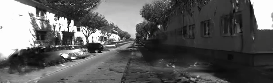

# Building Visual SLAM from Scratch: From Drifting Odometry to a Closed Loop

*Draft — a build log of a from-scratch self-driving perception + SLAM project on KITTI.*

---

## The question I started with

Self-driving perception roles (Tesla Autopilot, Apple AR) keep asking for the same
things: structure-from-motion, visual-inertial SLAM, mapping and localization,
metric 3D. I wanted to actually *build* that stack — not glue together a tutorial,
but implement the geometry myself and prove it on a real benchmark. So I picked
KITTI odometry and set a concrete goal: estimate a car's trajectory from its
cameras, measure how wrong I am, and then make it less wrong.

This is the story of getting from a trajectory that collapses into a scribble to
one that traces a 3.7 km loop and closes it — and the three bugs I had to debug
along the way.

## Step 1 — Monocular visual odometry, and the scale problem

Visual odometry estimates how the camera moved between two frames: find the same
feature points in both images (I used ORB), then recover the rotation and
translation from how those points shifted (the essential matrix).

It worked — locally. Frame-to-frame error (RPE) was ~0.26 m. But over the full
KITTI loop the trajectory **collapsed into a small tangle**, with an absolute
error (ATE) of 185 m. The culprit is fundamental: **a single camera cannot know
scale.** A small nearby motion and a large far motion look identical, so the
trajectory drifts in scale and curls up. The metric drives it home — after
aligning to ground truth, the recovered scale was 0.089 instead of 1.0.

That failure is exactly why job descriptions say *visual-**inertial** SLAM*: you
need another sensor (IMU, or a second camera) to pin down scale.

## Step 2 — Stereo fixes scale

KITTI is a stereo dataset: two cameras a known distance apart (the baseline,
~0.54 m). That known distance lets you triangulate **metric depth** for every
feature. With real 3D points in hand, you can estimate motion by PnP — match this
frame's 3D points to where they appear in the next frame and solve for the camera
pose that explains them, *in real metres*.

The change was dramatic:

| | recovered scale | ATE (full loop) |
|---|---|---|
| Monocular | 0.089 (collapsed) | 185 m |
| **Stereo** | **1.0 (metric)** | **26 m (~0.7%)** |

The trajectory now traces the actual loop. But it still **drifts** — small errors
accumulate, so by the end of the loop the streets don't quite line up. The loop
doesn't close.

## Step 3 — Loop closure, and three bugs

The fix for drift is loop closure: notice when the car revisits a place it's seen
before, and use that as a constraint to correct the whole trajectory. I built a
**pose graph** — nodes are camera poses, edges are constraints (sequential
odometry, plus loop-closure edges between revisited places) — and optimized all
poses to satisfy every constraint at once.

The first run made things **worse** (ATE 25 m → 29 m). The second run, worse
still. Loop closure that *increases* error means the constraints are wrong, and
chasing that down was the real work:

1. **Coordinate-frame handedness.** I represented poses in the ground plane (SE2).
   KITTI's vertical axis points *down*, which flips the sign of planar rotation
   relative to the standard SE2 convention. My yaw extraction was mirror-flipped,
   so loop constraints rotated translations the wrong way and the optimizer
   diverged. I added a unit test pinning the invariant: converting a 3D pose to
   SE2 and back must reproduce the planar geometry exactly.
2. **Graph consistency.** I'd derived odometry edges from full-3D relative poses
   while the nodes were 2D projections — so the backbone disagreed with itself
   before any loop closure. Fix: derive odometry edges from the node poses
   themselves, so *only* loop closures drive the correction.
3. **Outlier loops + speed.** Wide-baseline loop matches are noisy; a few bad ones
   dominate a plain least-squares solve. A robust loss (soft-L1) plus gating out
   implausible loops handled the outliers. And the optimization was painfully slow
   until I told the solver the Jacobian is **sparse** (each edge touches only two
   nodes) — that took the solve from minutes to seconds.

With those fixed, and a little parameter tuning (trust good loops, reject outliers
hard), loop closure finally did its job:

**ATE 25 m → 9.5 m — a 62% reduction in drift.**

The orange (SLAM) path sits almost on top of the black ground truth; the blue
(VO-only) path bows away from it. The loops are closed.

And it isn't overfit to one route: running the *same parameters* on KITTI seq 05
(a different drive) reduced drift from 8.6 m to 5.8 m (−33%). The pipeline
generalizes.

## Step 4 — From localization to mapping: Gaussian Splatting without COLMAP

A trajectory tells you *where the camera went*. The natural next question is *what
the world looks like* — and the modern answer is a neural 3D representation like
Gaussian Splatting, which fits millions of tiny 3D blobs to a set of posed images
so you can fly a virtual camera through a photorealistic reconstruction.

There's a catch the tutorials gloss over: Gaussian-Splatting trainers need to know
the camera pose for every image, and they normally get those by running **COLMAP**
— a slow structure-from-motion step that re-estimates the very thing my SLAM
pipeline already computes. So I skipped it. I exported my KITTI frames with the
camera poses straight from my **stereo VO**, in the format nerfstudio expects, and
trained `splatfacto` on a GPU. (The one real gotcha: my poses are in OpenCV camera
convention and nerfstudio wants OpenGL, so each pose gets a y/z axis flip.)

The result is a ~641K-Gaussian model of the street and a rendered flythrough —
built on *my* geometry, no COLMAP in the loop.

**The honest part:** the reconstruction is crisp along the direction of travel but
streaks and smears toward the frame edges. That's not a bug — it's geometry.
Dashcam-style forward driving gives almost no *sideways* parallax, so the trainer
has little information about surfaces off to the side. A route with turns, or a
sensor rig with wider viewpoints, would fill that in. Seeing the failure mode and
being able to explain *why* it happens is, to me, more valuable than a cherry-picked
clean render.

## Step 5 — Validating against perfect ground truth in CARLA

KITTI's ground truth comes from GPS/INS, which has its own noise — so when my VO is
off by a few metres, how much is the algorithm versus the sensor? To separate the
two, I built a capture pipeline in the **CARLA** simulator: drive a virtual car with
a synchronized stereo rig and record frames *plus the exact ground-truth pose*,
written in KITTI format so the same VO/SLAM code runs on it unchanged.

The fiddly bit is coordinate frames again — CARLA uses Unreal's left-handed system
(X-forward, Y-right, Z-up) and my code expects right-handed OpenCV (X-right, Y-down,
Z-forward). I isolated that change-of-basis into one unit-tested function so a
mirrored trajectory can't sneak through.

On a 1000-frame drive, my stereo VO scored **ATE ≈ 0.59 m** (RPE ≈ 0.02 m, scale
≈ 1.01) against CARLA's *perfect* ground truth — sub-metre, with the VO path sitting
almost exactly on the truth. That's a clean validation: on noise-free data the
algorithm itself is accurate to centimetres-per-frame, so most of KITTI's larger
error is real-world sensor noise, not the method.

## What I'd do next

This is a planar (SE2) pose graph in Python — great for learning and for this
result, but production SLAM uses full 6-DOF graphs in C++ (g2o / GTSAM / Ceres)
with sparse analytic Jacobians. Natural next steps: a second sensor for tighter
scale (visual-inertial), porting the geometry hot path to C++, and the experiment
the splat sets up — *can I relocalize a held-out frame by matching it against
novel views rendered from the Gaussian map, and does that beat a classical feature
map?* That's the research question worth chasing next.

## Takeaways

- **Build the metrics first.** I couldn't have debugged any of this without ATE/RPE
  and trajectory-alignment in place from day one.
- **Test the geometry synthetically.** Projecting known 3D points through known
  poses and checking the math recovers them caught real bugs with zero data.
- **Coordinate frames are where these systems quietly break.** A single flipped
  sign cost me two debugging sessions — and is exactly the kind of thing these
  roles probe for.

*Code: [github.com/shravani-01/CarlaSimulator](https://github.com/shravani-01/CarlaSimulator)*
